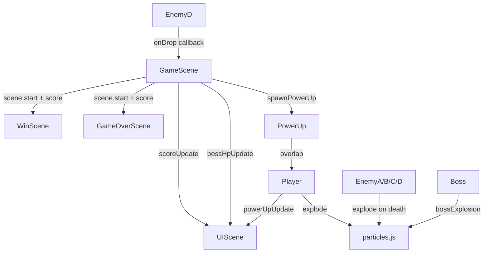

## 用户需求

按照 `EXECUTION_PLAN.md` 中 Phase 2 的规划，逐步为 2D 弹幕射击游戏实现 6 个里程碑的高级功能，全程遵循 Phaser 3 原生规范。

## 产品概述

在已完成的 Phase 1 MVP（含完整场景流转、Player、EnemyA/B/C、Boss）基础上，叠加进阶功能层：得分系统、粒子特效、道具系统、新型载具敌人，以及随时间动态提升的难度缩放，最终做一轮整合打磨。

## 核心功能

### M8 — 得分系统

- `GameScene` 中击杀加分：EnemyA=100、EnemyB=150、EnemyC=200、Boss=1000
- `UIScene` 左上角实时显示分数（`game.events` 事件总线：`scoreUpdate`）
- `WinScene` / `GameOverScene` 通过 `scene.start(key, { score })` 接收并展示最终分数

### M9 — 粒子特效

- 新建 `src/utils/particles.js`：基于 Phaser 3.60 新版粒子 API（`this.add.particles`）封装可复用工具函数
- 敌人死亡：彩色粒子爆炸，颜色与敌人类型对应
- Boss 死亡：多波次大爆炸序列（约 2 秒）
- 玩家引擎尾焰：飞行时持续蓝/白粒子流

### M10 — 载具敌人 EnemyD

- 新建 `src/entities/EnemyD.js`：慢速、HP=3、紫色发光、死亡必掉道具
- 新建 `src/entities/PowerUp.js`：向左漂移、玩家接触后激活对应武器模式
- 波次生成器：~45 s 时首次生成 EnemyD

### M11 — 道具系统

- `Player.js` 扩展三种武器模式（同时只激活一种，新道具替换旧道具）：Spread Shot（3-way ±15°，10s）、Laser（穿透光束，逐帧伤害，8s）、Rapid Fire（射速 ×3，蓄力减半，10s）
- `UIScene` 左下角展示当前道具名称 + 倒计时

### M12 — 难度缩放与敌人精调

- EnemyA：30s 子弹速度 +20%；60s 双向瞄准
- EnemyB：40s 俯冲触发距离 200→150px
- EnemyC：50s 连射间隔 2.5s→1.8s
- EnemyD：65s 时生成第二个 Carrier（保证道具类型不同）
- Boss 50% HP 触发狂暴：扩散弹 3-way→5-way，冲刺速度 +40%

### M13 — 整合打磨

- 验证系统交互、调参、移除 debug log、更新 EXECUTION_PLAN.md

## 技术栈

- **Phaser 3.60.0**（CDN，已确认版本，使用新版粒子 API `this.add.particles(x, y, tex, config)`）
- ES Modules，无构建工具，纯 HTML + JS

---

## 实现策略

### 事件总线（game.events）

所有跨场景通信沿用现有 `game.events` 模式：

- 新增 `scoreUpdate(score)` 事件：GameScene → UIScene
- 最终分数通过 `scene.start('WinScene', { score })` / `scene.start('GameOverScene', { score })` 以场景 `init(data)` 传入

### 得分系统（M8）

在 `GameScene._handlePlayerBulletHit` 死亡路径上调用 `this._addScore(points)`，Boss 在 `_onBossDefeated` 时加分。不修改各 Entity 内部逻辑，保持最小侵入。

### 粒子特效（M9）

Phaser 3.60 新 API：`scene.add.particles(x, y, '__WHITE', config)` 使用内置纹理，用 `emitParticleAt` 一次性触发；引擎尾焰用 `follow` + `startFollow` 持续跟随 Player sprite。封装为 `explode(scene, x, y, color, count, scale)` 与 `createEngineTrail(scene, sprite)` 两个函数，由各调用方引入。

### EnemyD + PowerUp（M10）

`EnemyD` 继承与 EnemyC 相同代码风格（手动 `_ensureTexture`、physics.add.image）；`PowerUp` 是一个轻量对象，持有 `type`（`'spread'|'laser'|'rapid'`）并向左移动，`GameScene._registerPowerUp` 注册玩家 overlap。EnemyD 的死亡回调通过构造时传入的 `onDrop(x, y, type)` 回调注入，保持解耦。

### 武器模式（M11）

Player 内新增 `_powerUpMode`（`null | 'spread' | 'laser' | 'rapid'`）和 `_powerUpTimer`（ms 剩余）。每帧 `update` 中计时并到期清除。Laser 采用一条 `Graphics` 光束 + 逐帧 overlap 检测（遍历活跃敌人），不额外创建 physics 对象，保持简洁。Spread/Rapid 复用现有 `normalBullets` 组，仅调整速度向量和 fireRate。

### 难度缩放（M12）

在各 Enemy 类中新增 `scaleDifficulty(level)` 方法，由 `GameScene._checkWaves` 在对应时间点调用；Boss 在 `hit()` 中检测 50% HP 阈值，首次触发 `_enrage()`，用布尔标志 `_enraged` 防重复。

### 激光碰撞检测

Laser 模式下在 `Player.update` 中每帧调用 `scene.checkOverlap`（Phaser arcade `overlap` 静态检测）或直接遍历 `scene.enemiesA/B/C/D`，通过 `Phaser.Geom.Rectangle.Overlaps` 做光束矩形 vs 敌人矩形碰撞，伤害节流 200ms/敌人，避免每帧大量伤害。

---

## 实现注意事项

- **粒子 API 版本**：Phaser 3.60 已确认，使用 `scene.add.particles(x, y, texture, emitterConfig)` 而非旧版 `createEmitter`；`quantity` + `lifespan` + `speed` + `scale` 直接写在 config 对象中
- **场景数据传递**：`WinScene`/`GameOverScene` 需新增 `init(data)` 钩子接收 `{ score }`，不能只依赖 `create()`
- **激光 Graphics**：必须在 Player 死亡或模式切换时立即 `setVisible(false)` / `clear()`，防止残影
- **EnemyD 波次时间**：现有波次使用压缩时间轴（Boss 20s），EnemyD 45s/65s 在压缩时间轴中有效；若未来切换为完整时间轴需同步调整
- **PowerUp 回收**：越出左边界或被拾取后立即 `setActive(false).setVisible(false)` + disable body，防止重复触发
- **M13 debug log 清理**：仅移除各 Entity 和 GameScene 中 `console.log('[HIT-CHECK]')`、`[FIRE-*]` 等开发日志，保留必要的 `[DEV]` toolbar 逻辑（便于后续调试）

---

## 架构设计



---

## 目录结构

```
src/
├── config/
│   └── sprites.js          # [MODIFY] 新增 enemyD、powerUp 纹理配置项
├── entities/
│   ├── Player.js           # [MODIFY] 新增三种武器模式、引擎尾焰入口、powerUpTimer
│   ├── EnemyA.js           # [MODIFY] 新增 scaleDifficulty()，支持子弹速度和双向瞄准
│   ├── EnemyB.js           # [MODIFY] 新增 scaleDifficulty()，支持俯冲距离缩减
│   ├── EnemyC.js           # [MODIFY] 新增 scaleDifficulty()，支持连射间隔收紧
│   ├── Boss.js             # [MODIFY] 新增 _enrage()，扩散弹 5-way，冲刺速度 +40%
│   ├── EnemyD.js           # [NEW] 载具敌人，紫色，HP=3，死亡触发 onDrop 回调
│   └── PowerUp.js          # [NEW] 道具拾取物，向左移动，type='spread'|'laser'|'rapid'
├── scenes/
│   ├── GameScene.js        # [MODIFY] 整合得分、粒子调用、EnemyD 注册、PowerUp 注册、难度缩放触发
│   ├── UIScene.js          # [MODIFY] 新增得分 HUD（左上）、道具名称+倒计时（左下）
│   ├── WinScene.js         # [MODIFY] 新增 init(data) 接收并展示最终分数
│   └── GameOverScene.js    # [MODIFY] 新增 init(data) 接收并展示最终分数
└── utils/
    └── particles.js        # [NEW] explode() + createEngineTrail() 工具函数
```

## Agent Extensions

### SubAgent

- **code-explorer**
- Purpose: 在实现各里程碑时，用于跨文件验证 entity 接口一致性、确认 Phaser 3.60 粒子 API 使用模式，以及检查各 Enemy 类的 hit/die 路径完整性
- Expected outcome: 确保各文件修改点精确定位，不遗漏调用链，避免引入回归