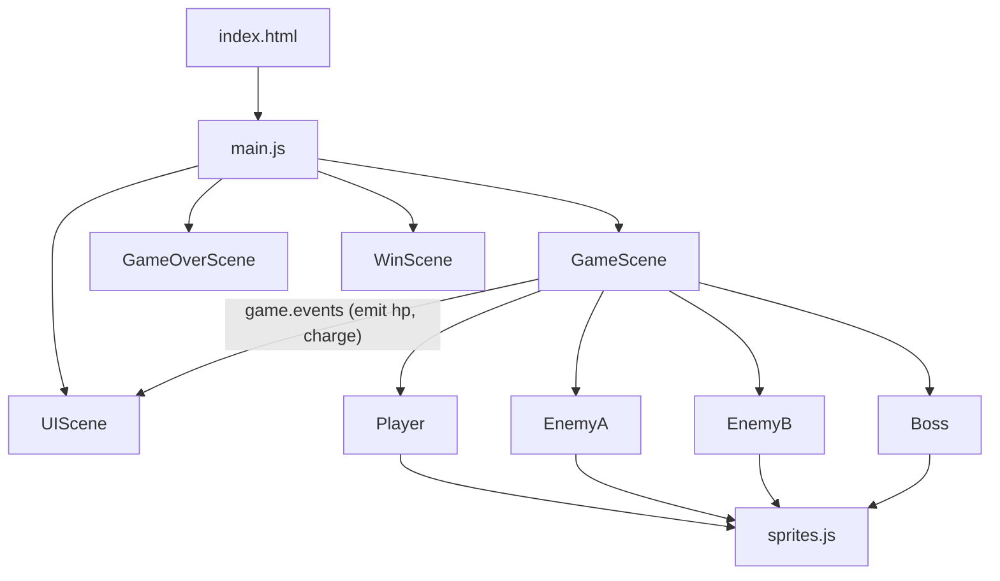

## User Requirements

Build the complete MVP space shooter game from scratch, following all 7 milestones defined in `EXECUTION_PLAN.md` and the design specs in `GDD.md`. The project starts empty (only docs exist).

## Product Overview

A horizontal auto-scrolling shoot 'em up game running in the browser (desktop). R-Type inspired. One level, one player ship, two enemy types, one boss. Placeholder geometry art (colored rectangles/shapes) with a sprite-swap config for future pixel art.

## Core Features

- **Scaffold**: `index.html` + Phaser 3 via CDN, scrolling star background, player movement with boundary clamping
- **Player Shooting**: Rapid-fire (Z key, auto-fire while held) + charge shot (X key, hold-to-charge, release-to-fire) with visual charge indicator
- **Enemy A (Sniper)**: Sine-wave movement from right, fires aimed bullets at player, 1-hit death
- **Enemy B (Kamikaze)**: Formation entry from right, straight flight then kamikaze dive within 200px, 1-hit death
- **Wave Spawner**: Time-based auto-scroll with scripted wave sequence (0–80s leading to boss)
- **Boss**: HP=20, single phase, 3 cycling attacks (spread, aimed, lunge), HP bar in HUD, death triggers Win screen
- **HUD (UIScene)**: Parallel scene showing charge bar and boss HP bar
- **Game Over / Win Screens**: With restart button

## Tech Stack

- **Phaser 3** (loaded via CDN in `index.html`, no build tool)
- **Plain JavaScript** (ES modules via `type="module"`)
- **No dependencies** beyond Phaser 3

---

## Implementation Approach

The game is built as a clean Phaser 3 multi-scene project. All game logic lives in ES module JS files. The `GameScene` drives gameplay and emits events to `UIScene` (which runs in parallel) for HUD updates. Entity classes extend `Phaser.GameObjects.Rectangle` or `Phaser.Physics.Arcade.Sprite` using Phaser's arcade physics for collision detection. A `sprites.js` config file centralizes all visual definitions so placeholder geometry can be swapped for pixel art without touching game logic.

**Key decisions:**

- **Arcade physics** for all entities — zero setup, fast AABB collision, sufficient for a shmup MVP
- **UIScene runs parallel** to GameScene (Phaser supports launching multiple scenes simultaneously) — clean separation between HUD and game logic, no z-index hacks
- **Time-based wave spawner** using Phaser's `this.time.addEvent` with a scripted timeline array — simple, readable, easy to adjust timing
- **Charge shot** tracks hold-duration in `update()`, scales a visual indicator rectangle, and fires on key-up
- **Boss state machine** uses a simple cycling index (0→1→2→0) with Phaser tweens for the lunge behavior

---

## Implementation Notes

- Phaser 3 CDN: use `https://cdn.jsdelivr.net/npm/phaser@3.60.0/dist/phaser.min.js`
- All placeholder graphics are created with `this.add.rectangle()` / `this.add.graphics()` — no texture loading needed for MVP
- Stars background: tile a Graphics object of white dots, scroll it each frame, wrap when off-screen
- Bullet groups use `Phaser.Physics.Arcade.Group` with `runChildUpdate: true` and `maxSize` cap to avoid leaks
- Boss HP bar: UIScene listens to a shared `EventEmitter` singleton (or Phaser's global event emitter `this.game.events`) — avoids tight coupling between scenes
- Player death: call `this.scene.start('GameOverScene')` and `this.scene.stop('UIScene')` together
- Charge indicator: a `Rectangle` child attached to the player, scaled on X each frame based on charge ratio
- Enemy B kamikaze dive: on trigger, use `this.physics.moveToObject(enemy, player, speed)` — one-liner in Phaser arcade physics
- Enemy A sine-wave: store `spawnY` and `time` offset, update `y = spawnY + Math.sin(t) * amplitude` each frame
- All scene keys as constants in `main.js` to avoid typo bugs

---

## Architecture Design



---

## Directory Structure

```
/Users/derekfung/Downloads/Projects/2D-bullet/
├── index.html                  # [NEW] Phaser 3 CDN, canvas container, loads src/main.js as type="module"
├── src/
│   ├── main.js                 # [NEW] Phaser game config (800x600, arcade physics), registers all scenes, exports SCENE_KEYS constants
│   ├── config/
│   │   └── sprites.js          # [NEW] Visual config map: entity name → { color, width, height } for placeholder rects; swap keys here when adding real sprites
│   ├── scenes/
│   │   ├── GameScene.js        # [NEW] Core gameplay: star background, wave spawner timeline, arcade physics groups, collision overlaps, boss trigger, scene transitions
│   │   ├── UIScene.js          # [NEW] Parallel HUD scene: charge bar (bottom-left), boss HP bar (top-center); listens to game.events for updates
│   │   ├── GameOverScene.js    # [NEW] "GAME OVER" text + Restart button; restarts GameScene+UIScene on click
│   │   └── WinScene.js         # [NEW] "YOU WIN" text + Restart button; same restart logic
│   └── entities/
│       ├── Player.js           # [NEW] Extends Phaser.Physics.Arcade.Image; handles 8-dir movement, boundary clamp, rapid-fire (Z), charge shot (X), charge indicator rect
│       ├── EnemyA.js           # [NEW] Extends Phaser.Physics.Arcade.Image; sine-wave movement, periodic aimed bullet firing, 1-hit death
│       ├── EnemyB.js           # [NEW] Extends Phaser.Physics.Arcade.Image; straight flight, kamikaze dive trigger at 200px, 1-hit death
│       └── Boss.js             # [NEW] Extends Phaser.Physics.Arcade.Image; HP=20, 3-behavior cycle (spread/aimed/lunge), emits hp-update events, death sequence
└── assets/                     # [NEW] Empty directory, placeholder for future pixel art sprites
```

## Agent Extensions

### Skill

- **frontend-design**
- Purpose: Apply production-grade visual polish to the placeholder geometry art, star background, HUD elements (charge bar, boss HP bar), and Game Over/Win screens
- Expected outcome: Visually cohesive in-game UI and screen layouts that look intentional and clean even with colored rectangles as stand-ins